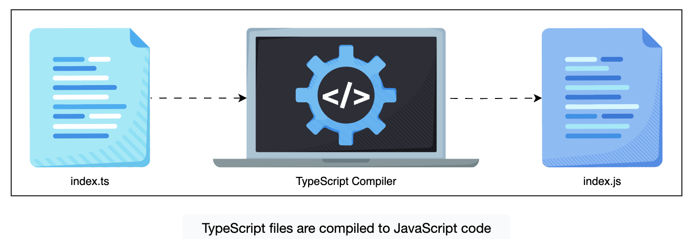

# Introduction to TypeScript

Types superset of JavaScript that compiles down to plain JavaScript.

### JS Example

```js
function greet(name) {
  return "Hello, " + name.toUpperCase();
}

console.log(greet("Mark"));
```

### TS Example

```ts
function greet(name: string): string {
  return "Hello, " + name.toUpperCase();
}

console.log(greet("Mark"));
```

We explicitly state that `name` is a `string` and `greet()` returns `string`. This helps in catching errors during compile time.



## Catching bugs early

### JS buggy code

```js
function getUser(id) {
  return { id, name: "Alice" };
}

console.log(getUser(1).email.toLowerCase()); // Cannot read property 'toLowerCase' of undefined
```

### How TS Handles it

```ts
function getUser(id: number): { id: number; name: string } {
  return { id, name: "Alice" };
}

console.log(getUser(1).email.toLowerCase()); // Error: Property 'email' does not exist
```

**Note:** Even if your code has type errors, TypeScript will still emit the compiled JavaScript by default. Unless we explicitly tell it to stop, TypeScript won’t block execution. That’s what makes TypeScript so approachable—you can adopt it incrementally and fix issues on your terms.

# Configuring TypeScript for Real-worlds Projects

## tsconfig.json

TypeScript needs to know how to interpret your project—what files to include, how strictly to type check, which JavaScript version to compile to, and more. That’s exactly what tsconfig.json does.

```json
{
  "compilerOptions": {
    "target": "ES2020",
    "module": "commonjs",
    "strict": true
  },
  "include": ["src"],
  "exclude": ["node_modules"]
}
```

What do these fields mean? Let’s break this down:

- **compilerOptions:** It is the brain of the config. This is where you control how TypeScript behaves.
- **target:** This tells the compiler what version of JS to emit. ES2020 is a common modern choice.
- **module:** This sets how modules are compiled (e.g., commonjs for Node, esnext for ESM).
- **strict:** This one flips on a whole suite of powerful type checks.
- **include:** This indicates which files to compile ("src" folder in this case).
- **exclude:** This indicates which files to ignore (By default TypeScript exclude node_modules).

### `strict` mode

This one flag activates settings like:

- **`strictNullChecks`:** This forces you to handle `null` and `undefined` explicitly.
- **`noImplicitAny`:** This prevents TypeScript from silently falling back to the `any` type when it can’t figure out what a variable should be. `any` disables type checking, so we want to avoid it unless we’re doing it on purpose.
- `strictFunctionTypes`, `alwaysStrict`, and more.

**Example:**

```ts
function greet(name) {
  return "Hello, " + name.toUpperCase();
}

console.log(greet("Alice"));
```

**Output:**

```
index.ts(1,16): error TS7006: Parameter 'name' implicitly has an 'any' type.
```

It won't allow implicit `any` type.

**Important:**

Even with strict mode on, TypeScript will still emit the compiled JavaScript by default, even if there are type errors. If you want to block output on error, you can set `"noEmitOnError": true`. This makes it easy to adopt strict checks gradually without breaking your workflow.

### Initialize TSConfig

`npx tsc --init`

# Type System and Type Errors

TypeScript `infers` types for you automatically behind the scene that's called type inference.

**Example:**

In the following code TypeScript infers that it is an integer so we don't need type annotation.

`let num = 10`

But that's not a good practice in TypeScript as it can make your code as fragie as JavaScript.

**Type Inference is Sticky**
You can change `num` to a string later or it will throw a compile time error.

### `let` vs. `const`: General vs. specific types

TypeScript pays attention to whether a value can change or not.

```ts
let mode = "dark"; // TypeScript assumes it might change later - so it gives it the general type `string`
const theme = "dark"; // TypeScript know that it will not change so it will give a more specific type based on the exact value.
```

Whenever possible use `const` it gives TypeScript stroger guarantee to work with.

# Type Annotation

Don't leave things to TypeScript type inference, rather user type annotations.

```ts
let username: string = "Ada";
let score: number = 42;
let isAdmin: boolean = true;

console.log(`Username: ${username}, Score: ${score}, Admin: ${isAdmin}`);
```

Type annotations are used to tell compiler the intent so those types can be enforced by the compiler.

If We are not using type annotations and the value is not clear enough for TypeScript to make a decision on the type then it falls back to `any` type.

**Example:**
This runs fine but it is breaking what TypeScript offers us and that is type saftey.

```ts
let result;
result = "done";
result = 42;

console.log(`Result is: ${result}`);
```

**Fix**

```ts
let result: string;
result = "done";
result = 42; // Error: Type 'number' is not assignable to type 'string'

console.log(`Result is: ${result}`);
```

## Modeling absence with union types: `null` and `undefined`

Is there a way to be flexible without giving up saftey? Yes there is! Here is an example:

```ts
let error: string | null = null;

error = "Something went wrong";

console.log(`Error: ${error}`);
```

Here we are saying that error may start with null but later is some value gets assigned to it then it will become string.

Symbol `|` represents **Union type**

## Annotating Functions

```ts
function greet(fname: string, lname: string): string {
  return `Hello ${fname} ${lname}`;
}
```

## Function with optional parameter

```ts
function log(message: string, userId?: string) {
  if (userId) {
    console.log(`[${userId}] ${message}`);
  } else {
    console.log(message);
  }
}

log("System started");
log("File deleted", "admin123");
```

# Understanding any and unknown

`any` turns off TypeScript's entire type checking system.

```ts
let value: any = "hello";
// value(); fails at run time
value.trim();
//value.toFixed(); fails at run time

console.log(`Value: ${value}`);
```

## unknown

`unknown` is safer option if you don't yet know a value's type. It refuses to abondon saftey. It lets us assign any value to a variable, but we can't use it until we prove what it is.

```ts
let input: unknown = "Ada";
// input.trim(); // Error!

console.log(`Input is: ${input}`);
```

**Line 2:** Even though it's a string, we can't use string methods without first checking or asserting the type. Instead of turning off the compiler we delay the decision and force ourselves to earn type confidence.

To work with `unknown`, we use runtime type guards-they let us confirm what a value is before we use it.

## Type guards: making `unknown` usable

Tools: `typeof`, `in`, `instanceof` (instance of a particular class)

```ts
function analyzeType(input: unknown): void {
  if (typeof input === "string") {
    console.log("Uppercased string: " + input.toUpperCase());
  } else if (input instanceof Date) {
    console.log("Date timestamp:" + input.getTime());
  } else if (typeof input === "object" && input !== null && "length" in input) {
    console.log("Array length:", input.length);
  } else {
    console.log("Unknown type");
  }
}

analyzeType("hello");
analyzeType(new Date());
analyzeType([1, 2, 3]);
analyzeType(42);
```

Each of the above check helps TypeScript narrows down the type correctly.

## Usecase 1: Type Assertions

This doesn't change the runtime behavior but changes how TS treats the value at compile time.

```ts
let input: unknown = "42";
const name1 = input as string;
const name2 = <string>input; // Angle-bracket assertions work in .ts files, but not in .tsx/JSX files

console.log(`Name1: ${name1}, Name2: ${name2}`);
```

`as` is recommended for consistency and compatibility

**Important:** With assertion the type saftey is in our hand. See the following example.

```ts
function process(input: unknown) {
  // ...
  const name = input as string;
  console.log("Hello,", name.toUpperCase());
}

process("typescript"); // Works
process(42); // compiles — but crashes at runtime!
```

## Usecase2: DOM elements and the default HTMLElement type

Imagine we're selectig a DOM element with `document.querySelector`. TypeScript knows it returns `Element | null`, but it has no clue about the actual subtype-like `HTMLButtonElement`.

That's a problem when we want to access a property like `.disabled`, because it doesn't exist on plain `HTMLElement`. Here we can use type assertion.

const btn = document.querySelector("#toggle") as HTMLButtonElement;

```ts
const btn = document.querySelector("#toggle") as HTMLButtonElement;

if (btn) {
  btn.addEventListener("click", () => {
    btn.disabled = true;
  });
}
```

When you are certain that the DOM element is present then you can add `null` assertion (! symbol) as well

```ts
const btn = document.querySelector<HTMLButtonElement>("#toggle")!;
btn.disabled = true;
```

## Type conversion

```ts
let rawInput: unknown = "42";

if (typeof rawInput === "string") {
  const userId = Number(rawInput);
  console.log("User ID:", userId.toFixed(2)); // 42.00
}
```
